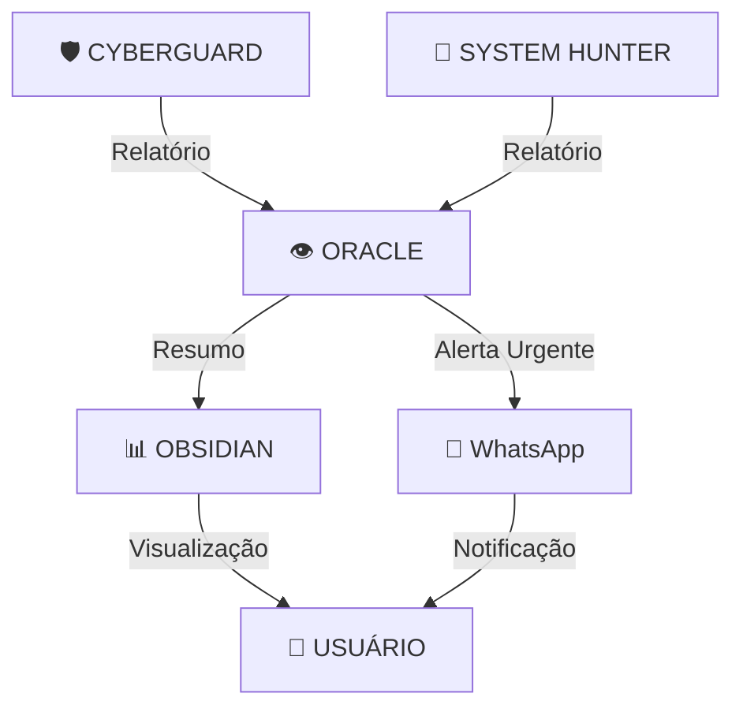

# 🌌 ATENA OS - Mapa de Agentes e Nós
> Sistema de monitoramento 24/7 — Gerado automaticamente

---

## 🛡️ CYBERGUARD (Segurança)
**Status:** 🟢 Ativo | **Ciclo:** 6h/12h/18h

### Sub-Agentes
- 📡 **Port Scanner** — Verifica portas abertas no sistema
- 🕵️ **Threat Monitor** — Detecta processos suspeitos
- 🔐 **Firewall Check** — Analisa configurações de rede
- 🔌 **Conexões Ativas** — Monitora conexões estabelecidas

### Última Execução: `{{última_execucao_cyberguard}}`
### Relatório: `agents/cyberguard/reports/relatorio.md`

---

## 👻 SYSTEM HUNTER (Atualizações)
**Status:** 🟢 Ativo | **Ciclo:** 8h/14h/20h

### Sub-Agentes
- 🔄 **Update Checker** — Verifica pacotes desatualizados
- ⚡ **Performance Tuning** — Otimiza memória e CPU
- 🧹 **Cache Cleaner** — Limpa arquivos temporários
- 📊 **System Info** — Coleta métricas do sistema

### Última Execução: `{{última_execucao_hunter}}`
### Relatório: `agents/hunter/reports/relatorio.md`

---

## 👁️ ORACLE (Supervisor)
**Status:** 🟢 Ativo | **Ciclo:** Após cada agente

### Sub-Agentes
- ✅ **Revisor** — Coleta e valida relatórios
- 🚨 **Alertas** — Detecta anomalias
- 📊 **Resumo Geral** — Consolida informações
- 📤 **Notificador** — Envia resumo via WhatsApp

### Última Execução: `{{última_execucao_oracle}}`
### Relatório: `agents/oracle/reports/supervisao.md`

---

## 🔗 Mapa de Conexões (N8N)

---

## 📊 Status Geral

| Componente | Status | Último Check |
|------------|--------|--------------|
| 🛡️ CYBERGUARD | 🟢 | `{{check_cyberguard}}` |
| 👻 HUNTER | 🟢 | `{{check_hunter}}` |
| 👁️ ORACLE | 🟢 | `{{check_oracle}}` |
| 🔗 N8N | 🟢 | `{{check_n8n}}` |
| 📱 Termux | 🟢 | `{{check_termux}}` |
| ☁️ Tailscale | 🟢 | `{{check_tailscale}}` |

---

## ⚡ Ações Rápidas

- [ ] Revisar relatórios pendentes
- [ ] Verificar logs de erro
- [ ] Otimizar performance manual
- [ ] Limpar cache manualmente

---

*Gerado por ORACLE em: `{{data_geracao}}`*
*Sistema: Atena OS v1.0 — Modo Quântico*