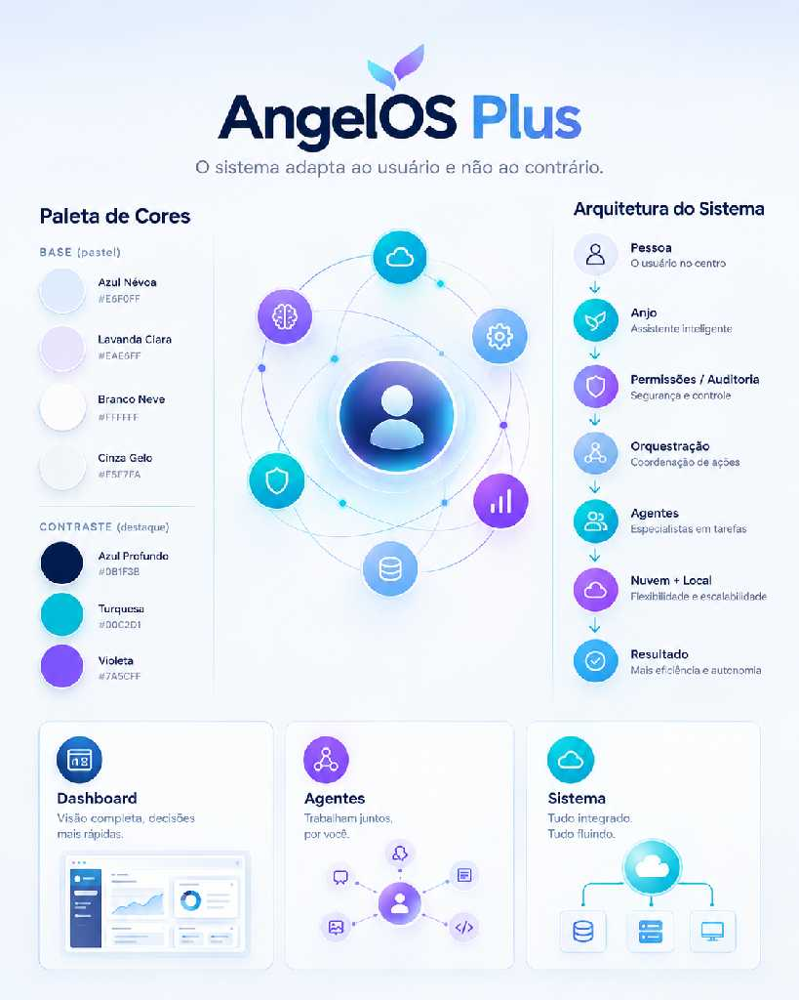

# Identidade visual — AngelOS Plus

## Impressão geral

A identidade comunica bem o propósito: tecnologia modular e inteligente, com a pessoa no centro. O símbolo de duas formas em turquesa e violeta, o nome com “Plus” destacado e o lema criam uma assinatura fácil de reconhecer. O diagrama lateral ajuda a relacionar a marca com a arquitetura, enquanto os cartões inferiores mostram usos possíveis da linguagem visual.

## Elementos de marca

- **Nome:** AngelOS Plus.
- **Lema:** “O sistema adapta ao usuário e não ao contrário.”
- **Símbolo:** duas formas leves em turquesa e violeta, sugerindo adaptação e conexão.
- **Composição:** pessoa no centro, cercada por funções e agentes conectados.
- **Formas:** ícones circulares, módulos arredondados e linhas finas.

## Paleta indicada no painel

| Uso | Cor | Código exibido |
|---|---|---|
| Base | Azul Névoa | `#E6F0FF` |
| Base | Lavanda Clara | `#EAE6FF` |
| Base | Branco Neve | `#FFFFFF` |
| Base | Cinza Gelo | `#F5F7FA` |
| Contraste | Azul Profundo | `#0B1F3B` |
| Destaque | Turquesa | `#00C2D1` |
| Destaque | Violeta | `#7A3CFF` |

## Recomendações de uso

- Manter fundos claros e usar azul profundo para títulos e texto principal.
- Reservar turquesa e violeta para destaques, estados e conexões — sem competir com a informação.
- Preservar bastante espaço em branco, linhas finas e ícones circulares.
- Manter a pessoa no centro das ilustrações; os agentes e a infraestrutura devem aparecer como suporte.
- Garantir contraste e aumentar textos pequenos em aplicações para celular.
- Usar o lema exatamente como escrito acima.

## Observação de maturidade

O painel é a referência visual/conceitual enviada para o projeto. Elementos como “tudo integrado” ou “mais eficiência” devem ser apresentados como visão desejada, não como resultados comprovados do produto atual. Os códigos hexadecimais foram transcritos do próprio painel.
